# I Craft You

I Craft You is a digital marketplace for craftswomen, craftsmen and small stores.

## SPA application

I Craft You is a React Single Page Application (SPA) built with Vite.

### Advantages

- Improved User Experience
- Real-time Interactivity
- Fast and Efficient Loading
- Smooth Transitions Between Screens
- Enhanced Perception of Modernity
- Adaptability for Mobile Applications
- Reduced Server Load

## Starting the app

To start the application, first configure the required environment variables as outlined in the .env.example file. Then, install the necessary dependencies by running the following command:

```sh
npm install
```

## The core of I Craft You

The application is built around four core features and the relationships established between them, which vary depending on whether the user is authenticated or not:

- Authentication
- The Users collection
- The Ads collection
- The Chat engine

### Authentication

When a user registers for the service, their information is saved in a MongoDB database by the back-end. Simultaneously, the user is automatically logged in and receives a JWT token from the server. This token is then included in all subsequent requests made from the client side.

### Open areas

There are several actions a user can take without needing to be authenticated or even registered:

- Browse and filter the list of ads
- View details of individual ads
- Access public profiles of registered users
- Switch languages between English and Spanish
- Register for the service
- Log in to the service

### Restricted areas

Here are the actions a user can take once they are registered and logged in:

- Post new ads
- Like, comment on and rate other users ads
- Order and accept/reject transactions
- Access and review transactions history
- Edit or delete their own ads
- Initiate and participate in chats with other users
- View chat history
- Manage their public profile
- Manage their account settings
- Delete their account

## User Registration and Login

### User Registration Process

Here's an example of the user registration process:

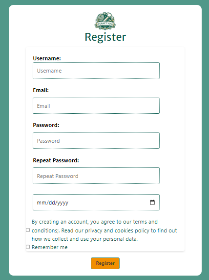

### User Login

Once a user has registered, they can use the regular login form to access their account:

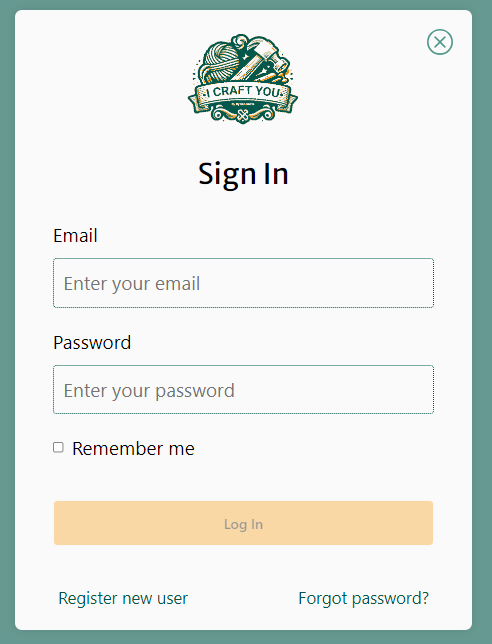

## The Ads Showcase

## The Ads Showcase

The ads panel is the main component that populates the Home page:

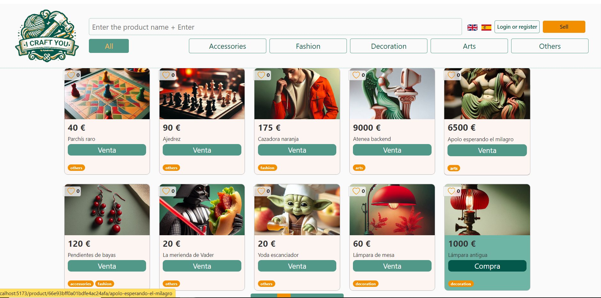

This feature is complemented by a paginator:

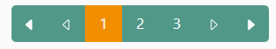

## The Ads Filter Component

The ads filter component is a key feature located in the header, providing multiple filtering options:

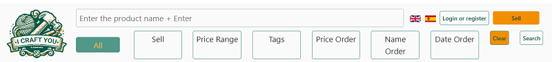

## The Ads Detail View

When authenticated, users can access the following features in the Ads Detail View:

- Like the product
- Comment on the product
- Rate the product
- Start a chat with the product owner
- Buy the product

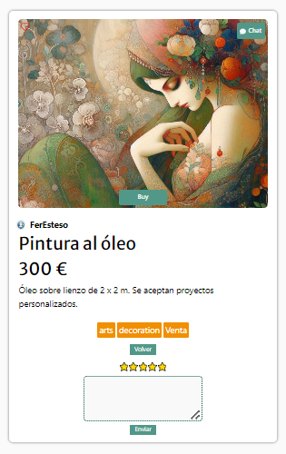

## User Profiles

### Not Authenticated

Unauthenticated users can access the public profiles of other users, where they can view public images and product listings:


## Private Area

After logging in, users can access their private area to perform several actions:

- Update their public profile
- View and update their private data
- Check reserved products
- View sales history
- View purchases history
- Manage their wishlist
- Access the chat
- Execute sensitive account-related actions

### Edit Public Profile

Authenticated users have the ability to edit their own public profiles, including updating images and descriptions:

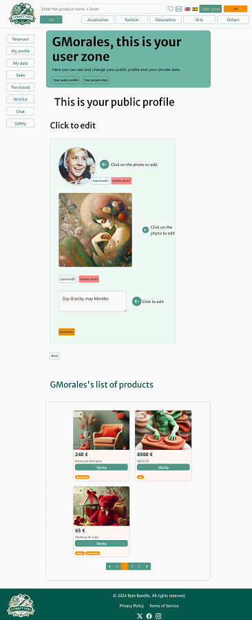

### View and update private data

#### Personal Information

Manage your identification and contact details:

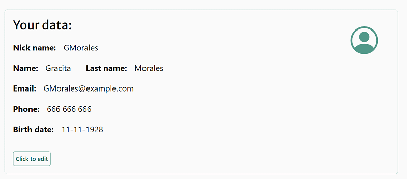

#### Address

Manage your postal address information:

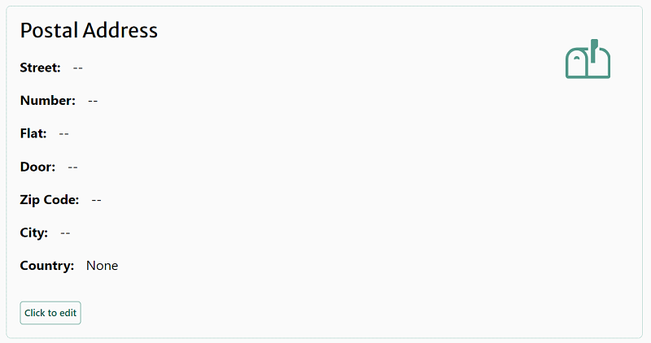

#### Credit Card

Update your payment method details:

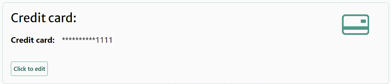

## Check Reserved Products

When a user clicks the "Buy" button on a product, the ad owner receives a purchase request, which is displayed in their "Reserved" section.

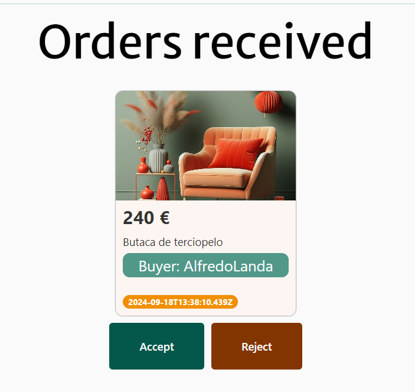

## View Sales History

In the Sales section, users can view a list of items they have sold, as well as those currently available for sale.

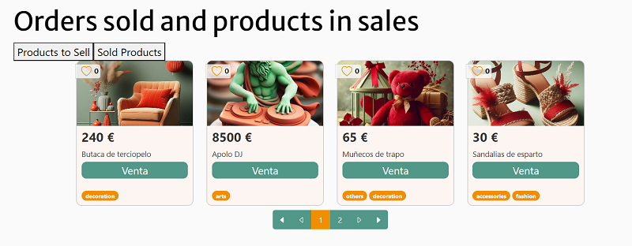

## View Purchases History

In the Purchases section, users can view a list of items they have purchased, as well as those they are currently interested in.

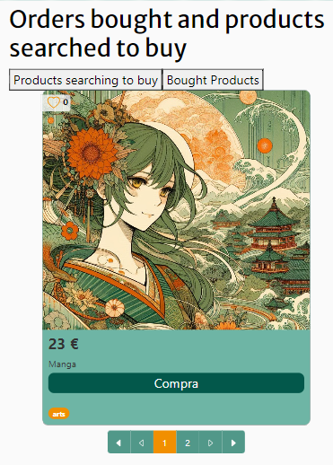

## Manage the Wishlist

In the Wishlist section, users can view a list of items they like.


## Chat

In the Chat section, users can communicate directly with the owners of the products they are interested in.

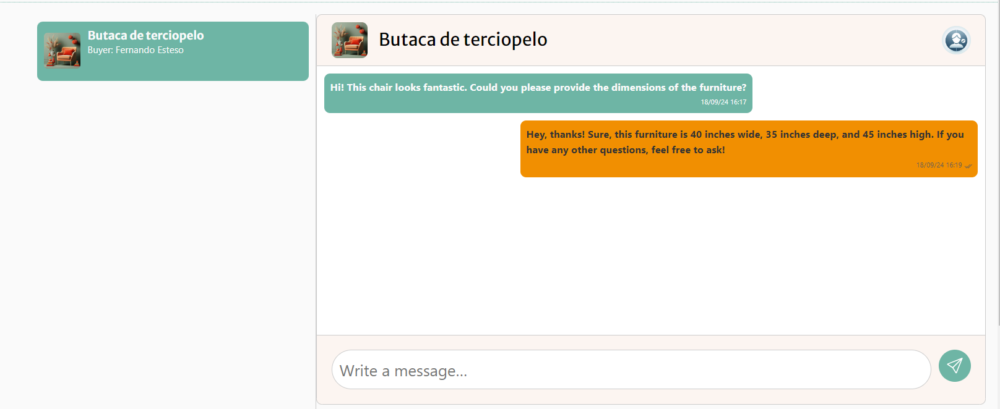

## Execute Sensitive Account-Related Actions

Under the Safety section, users can perform the following actions:

### Update Nickname and Email

(This action requires password confirmation)

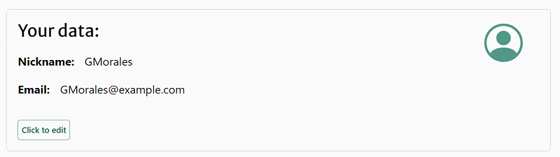

### Update Password

(This action requires password confirmation)

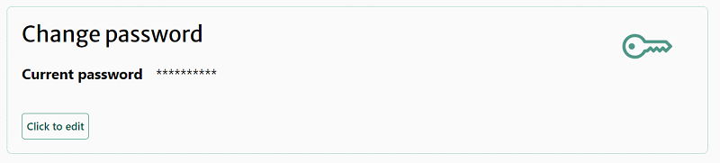

### Delete Account

(This action requires password confirmation)

Once the account is deleted, all sensitive user data is cleared. However, their user and product IDs remain stored under an anonymous account.

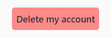
